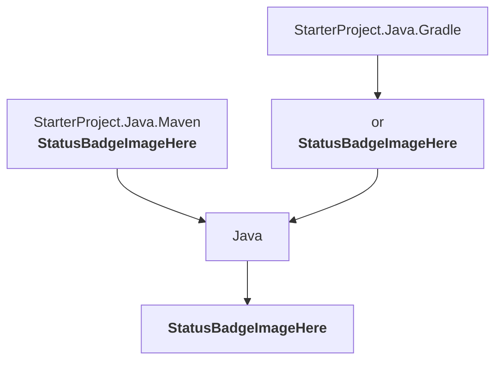

```mermaid
 
  graph TD
  id1[StarterProject.Java.Maven<BR><B>StatusBadgeImageHere</B>] -->   Java;
  StarterProject.Java.Gradle--> id2[or<br><b>StatusBadgeImageHere</b>] --> Java;
  Java --> id3[<b>StatusBadgeImageHere<b>]
  
```
